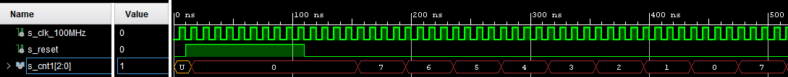

# Běžící text na 7-seg displeji

### Členové týmu

* Ondřej Kudela   (implementace shift_array)
* Daniel Kunčický (simulace, nastavení clk)
* Petr Mička      (debug, video editor)
* Jan Lakomý      (debug, github odborník)

### Obsah

* [Cíl projektu](#objectives)
* [Popis Hardware](#hardware)
* [VHDL popis modulů a simulace](#modules)
* [TOP modul a simulace](#top)
* [Programovací soubor](#bit)
* [Video](#video)
* [Zdroje](#references)

## Cíl projektu
Cílem projektu je zobrazit na 7-segmentových displejích běžící text. Využijeme k tomu posuvné pole (shift array), které vždy po nastavené době posune obsah pole o jeden znak.

## Popis Hardware
K realizaci zadání nebyl potřeba žádný externí hardware. Řešení probíhalo na desce Nexys A7-50T, což je
kompletní platforma pro vývoj digitálních obvodů. Využívá FPGA Artix-7. Obsahuje mnoho vestavěných zařízení jako: teplotní senzor, USB, Ethernet, zesilovač pro repreduktor, I/O zařízení a další.

## VHDL popis modulů a simulace
V projektu jsou z velké části využity ukázkové moduly z hodin počítačového cvičení.

### 7-seg display driver
Slouží k zobrazování znaků na displeji. Jako vstup mu slouží 32bit pole (data_i), které získá od shift_array.
K aktualizaci hodnot jednotlivých displejů dochází postupně (7-0) a jejich výběr probíhá pomocí 3bit čítače, kdy každý displej má přiřazeno vlastní číslo.

Odkaz na kód: [driver_7seg_8digits](https://github.com/secretnameis/scrolling_7seg/blob/main/project_3/project_3.srcs/sources_1/new/driver_7seg_4digits.vhd)

testbench: [tp_driver_7seg_8digits](https://github.com/secretnameis/scrolling_7seg/blob/main/project_3/project_3.srcs/sim_1/new/tb_driver_7seg_4digits.vhd)

### shift_array
Shift array zajišťuje "běhání" zobrazované zprávy. Posun je řízen druhou instancí hodin, která je pomalejší. Při resetu si načte zprávu, kterou chceme zobrazit, do 64bit pole a poté při každém s_en2 signálu posune obsah o 4 bity.

Odkaz na kód: [shift_array](https://github.com/secretnameis/scrolling_7seg/blob/main/project_3/project_3.srcs/sources_1/new/shift_array.vhd)
   
   testbench: [tb_shift_array](https://github.com/secretnameis/scrolling_7seg/blob/main/project_3/project_3.srcs/sim_1/new/tb_shift_array.vhd)
   
   

### clock_enable
#### 1.clock
První instace clock_enable poskytuje s_en1 signál čítači a tím řídí obnovovací frekvenci displeje. Čím je g_MAX nižší, tím rychleji se všech 8 displejů přepíše. Vždy se přepisuje pouze jeden z displejů.
#### 2.clock
Druhá instance clock_enable slouží k aktivaci posunu znaků v shift_array. Čím vyšší g_MAX, tím pomaleji se bude zpráva posouvat.

Odkaz na kód: [clock_enable](https://github.com/secretnameis/scrolling_7seg/blob/main/project_3/project_3.srcs/sources_1/new/clock_enable.vhd)

### cnt_up_down
Čítač slouží k výběru displeje. Při resetu se vynuluje a poté vždy při vzestupné hraně CLK čítá dle nastavené velikosti (g_CNT_WIDTH=3) tedy od 7 do 0.

Odkaz na kód: [cnt_up_down](https://github.com/secretnameis/scrolling_7seg/blob/main/project_3/project_3.srcs/sources_1/new/cnt_up_down.vhd)

### hex_7seg
Dekóduje dodané hex_i hodnoty a překládá je na 8bit binární kód (seg_o), který pak buď zapne daný segment (0) nebo vypne (1).
Například x"6" == "0100000" zobrazí na displeji číslo 6.

Odkaz na kód: [hex_7seg](https://github.com/secretnameis/scrolling_7seg/blob/main/project_3/project_3.srcs/sources_1/new/hex_7seg.vhd)

## TOP modul
TOP modul mapuje jednotlivé fyzické displeje s výstupy z driveru.

Odkaz na kód: [top](https://github.com/secretnameis/scrolling_7seg/blob/main/project_3/project_3.srcs/sources_1/new/top.vhd)

## Programovací soubor

Odkaz: [top.bit](https://github.com/secretnameis/scrolling_7seg/blob/main/project_3/project_3.runs/impl_1/top.bit)

## Video

Write your text here

## Zdroje

1. Moduly z hodin
2. shift array: [youtube.com/watch?v=V6YUEPRc64M](https://www.youtube.com/watch?v=V6YUEPRc64M)
3. popis desky [digilent.com/reference](https://digilent.com/reference/programmable-logic/nexys-a7/reference-manual?redirect=1)
